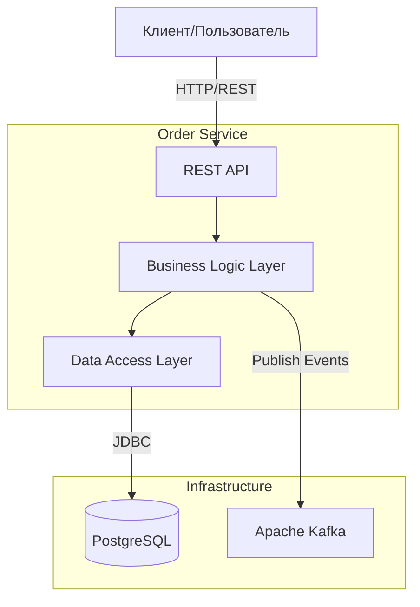

# Архитектура

```mermaid
graph TB
    Client[Клиент/Пользователь]
    
    subgraph "Order Service"
        API[REST API]
        Business[Business Logic Layer]
        Data[Data Access Layer]
    end
    
    subgraph "Infrastructure"
        PG[(PostgreSQL)]
        Kafka[Apache Kafka]
    end
    
    Client -->|HTTP/REST| API
    API --> Business
    Business --> Data
    Data -->|JDBC| PG
    Business -->|Publish Events| Kafka
    
    

```