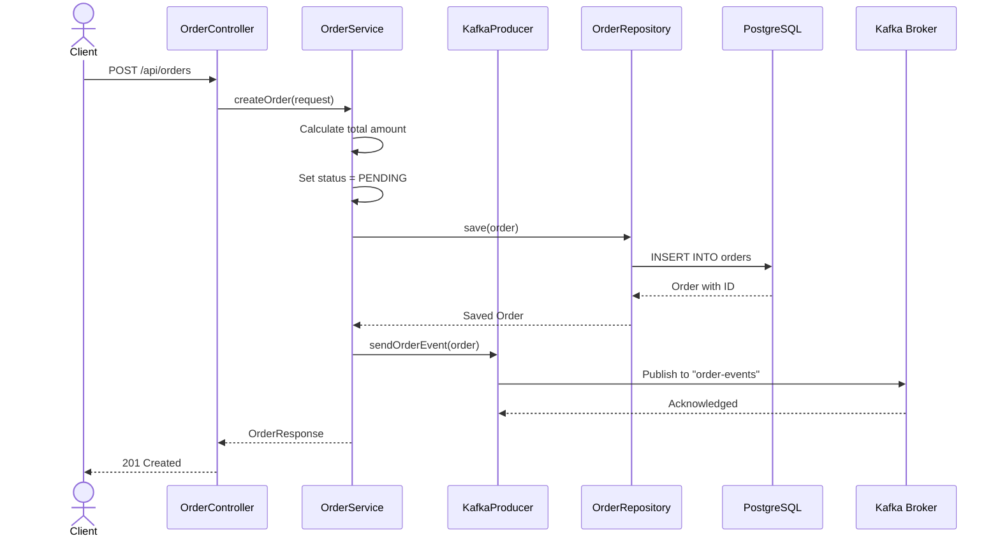
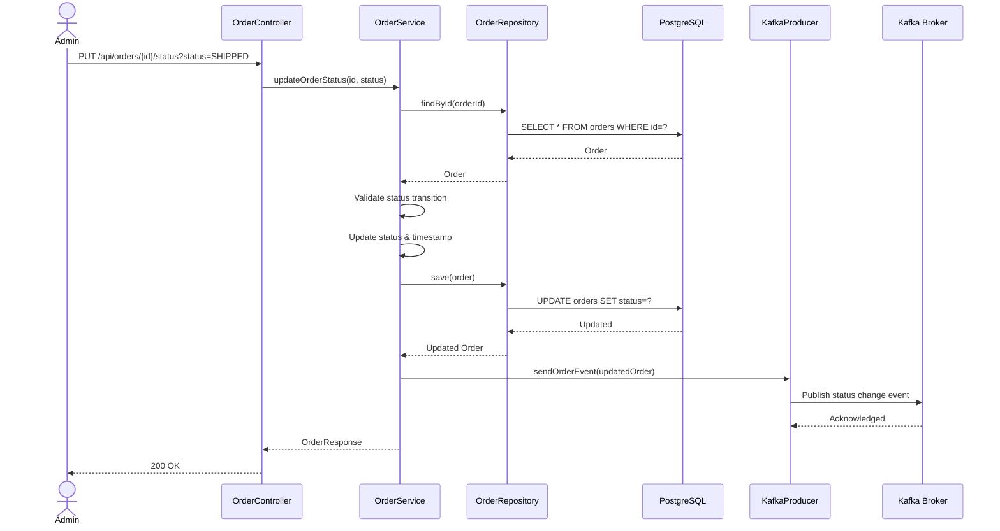

# Сиквенсы

## Поток создание заказа 

```mermaid
sequenceDiagram
    actor Client
    participant Controller as OrderController
    participant Service as OrderService
    participant Kafka as KafkaProducer
    participant Repo as OrderRepository
    participant DB as PostgreSQL
    participant Broker as Kafka Broker
    
    Client->>Controller: POST /api/orders
    Controller->>Service: createOrder(request)
    
    Service->>Service: Calculate total amount
    Service->>Service: Set status = PENDING
    
    Service->>Repo: save(order)
    Repo->>DB: INSERT INTO orders
    DB-->>Repo: Order with ID
    Repo-->>Service: Saved Order
    
    Service->>Kafka: sendOrderEvent(order)
    Kafka->>Broker: Publish to "order-events"
    Broker-->>Kafka: Acknowledged
    
    Service-->>Controller: OrderResponse
    Controller-->>Client: 201 Created
```

## Поток обновления статуса заказа

```mermaid
    sequenceDiagram
    actor Admin
    participant Controller as OrderController
    participant Service as OrderService
    participant Repo as OrderRepository
    participant DB as PostgreSQL
    participant Kafka as KafkaProducer
    participant Broker as Kafka Broker
    Admin ->> Controller: PUT /api/orders/{id}/status?status=SHIPPED
    Controller ->> Service: updateOrderStatus(id, status)
    Service ->> Repo: findById(orderId)
    Repo ->> DB: SELECT * FROM orders WHERE id=?
    DB -->> Repo: Order
    Repo -->> Service: Order
    Service ->> Service: Validate status transition
    Service ->> Service: Update status & timestamp
    Service ->> Repo: save(order)
    Repo ->> DB: UPDATE orders SET status=?
    DB -->> Repo: Updated
    Repo -->> Service: Updated Order
    Service ->> Kafka: sendOrderEvent(updatedOrder)
    Kafka ->> Broker: Publish status change event
    Broker -->> Kafka: Acknowledged
    Service -->> Controller: OrderResponse
    Controller -->> Admin: 200 OK
```